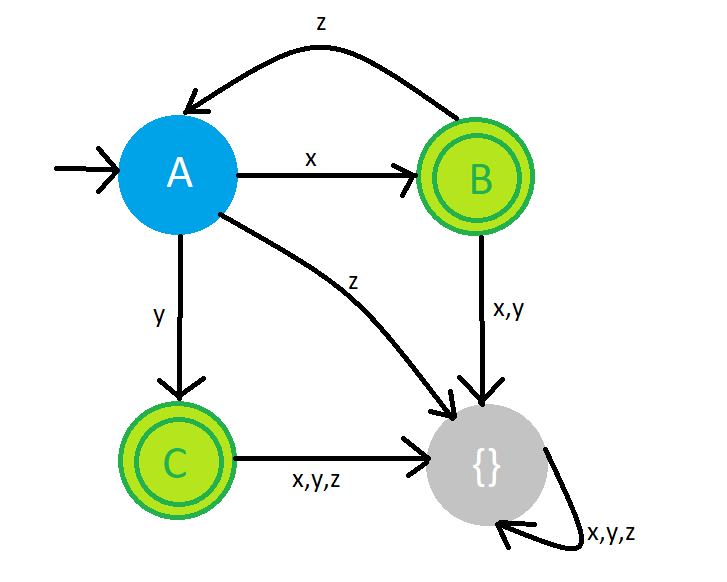

# Lab 1 - Tiger Language

## Tiger Programs

### hello.tig
Prints "Hello World!" followed by a newline to standard output.

### fibonacci.tig
Recursive implementation of the Fibonacci sequence.
Returns the n-th term where F0=1, F1=1, F(n+2)=F(n)+F(n+1).
Prints terms from F1 to F8.

### read_unsigned.tig
Reads a line from stdin character by character using `getchar()` and `ord()`.
Returns the number as a positive base-ten integer if the line contains only digits, -1 otherwise.

## Regular Expressions
Alphabet Σ = {a, b}

### regexp1.txt
Words where the first `a` (if any) precedes the first `b` (if any).

**Solution: `^a*b*$`**

### regexp2.txt
Words where the number of `a` is even (0 is considered even).

**Solution: `^b*(aab*)*$`**

## Automata Determinisation

### 1. Language accepted by the automaton
Answer: L = x((zx)*zy)? | y

### 2. Why it is not deterministic
State 1 has an ε-transition to state 2 and x-transition to 5, which makes the automaton non-deterministic.
In a DFA, ε-transitions are not allowed.

### 3. Determinisation (NFA → DFA via subset construction)

ε-closures and state classifying:
- ε-closure(1) = {1, 2, 3, 4} - state A
- ε-closure(2) = {1, 2, 3, 4} 
- ε-closure(5) = {5, 6, 7} - state B
- ε-closure(6) = {6, 7} - state C

Transition table:

| DFA state | NFA states | x | y | z | Final? |
|-----------|------------|---|---|---|--------|
| A         | {1,2,3,4}  | B | C | ∅ | No     |
| B         | {5,6,7}    | ∅ | ∅ | A | Yes    |
| C         | {6,7}      | ∅ | ∅ | ∅ | Yes    |
| ∅         | {}         | ∅ | ∅ | ∅ | No     |

Initial state: A  
Final states: B, C (contain NFA state 7)

